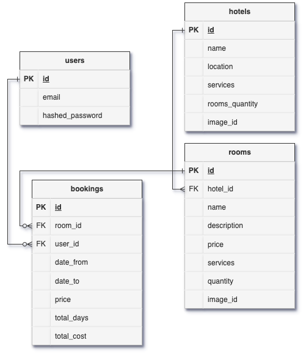
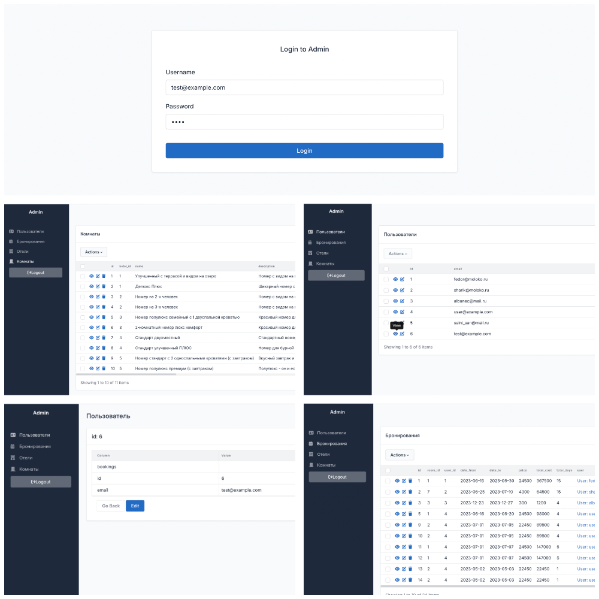

# Booking

Приложение для поиска и бронирования отелей.
Сервис на FastAPI с валидацией данных Pydantic и ORM — SQLAlchemy. В качестве СУБД используется PostgreSQL.

Аналитика ошибок сервиса проводится с помощью Sentry, мониторинг за скоростью обработки запросов и их количеством Prometheus + Grafana.
Кэширование и фоновые задачи - Redis и Celery.

Необходимо настроить конфиг **.env-no-dev** (пример **.env-example**), 
по умолчанию переменные будут скопированы из примера при запуске Makefile.

Сборка образов и запуск:
```bash
make
```

 - [База данных](#База-данных)
 -  [Интерфейс администратора](#Интерфейс-администратора)

  

### База данных
Таблицы:
 - users - с учетными записями пользователей;
 - hotels - с данными об отелях;
 - rooms - с данными о комнатах отелей;
 - bookings - с записями бронирований комнаты пользователем.





### Интерфейс администратора
Графический интерфейс для работы с БД, разработан на библиотеке [https://github.com/aminalaee/sqladmin](https://github.com/aminalaee/sqladmin)



